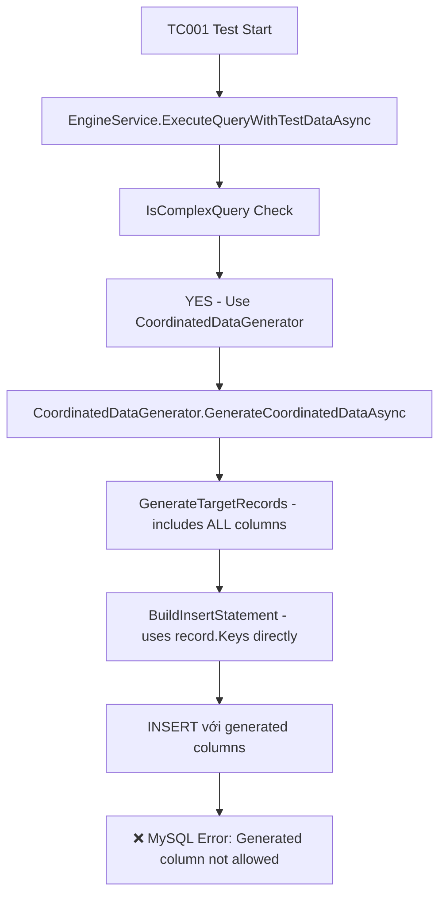

# Root Cause Analysis: Generated Column Bug

## 🔍 Tại sao lại có bug này?

### 1. **Hai Data Generators với Logic Khác Nhau**

Engine có **2 generators** với logic filtering columns **KHÁC NHAU**:

#### ✅ DataGenService.GenerateBogusData() - ĐÚNG
```csharp
// 🎯 ENHANCED FILTERING: Exclude identity AND generated columns
var columns = table.Columns.Where(c => !c.IsIdentity && !c.IsGenerated).ToList();
```
**→ Filters out generated columns correctly**

#### ❌ CoordinatedDataGenerator.BuildInsertStatement() - SAI  
```csharp
private string BuildInsertStatement(string tableName, Dictionary<string, object> record, DatabaseType databaseType)
{
    var columns = string.Join(", ", record.Keys.Select(k => QuoteIdentifier(k, databaseType)));
    //                              ^^^^^^^^^^^^
    //                              NO FILTERING - Uses ALL record.Keys
}
```
**→ Uses ALL columns từ record.Keys, không filter out generated columns**

### 2. **Flow Logic trong TC001**



### 3. **Complex Query Detection**
```csharp
private bool IsComplexQuery(string sqlQuery)
{
    var hasJoins = queryLower.Contains("join");           // ✅ TRUE
    var hasLikeConditions = queryLower.Contains("like");  // ✅ TRUE  
    var hasYearConditions = queryLower.Contains("year("); // ✅ TRUE
    
    return hasJoins && (hasLikeConditions || hasYearConditions); // ✅ TRUE
}
```

**TC001 query** classified as **COMPLEX** → Uses `CoordinatedDataGenerator` → Bug triggered!

### 4. **Tại sao DataGenService.GenerateBogusData() có filter đúng?**

Từ commit history, có thể đây là kết quả của:
1. **Bug fix trước đó**: Generated column issue được fix trong `DataGenService` 
2. **Inconsistent update**: `CoordinatedDataGenerator` không được update cùng lúc
3. **Code duplication**: Hai generators có logic build INSERT khác nhau

### 5. **Tại sao không phát hiện sớm hơn?**

1. **CoordinatedDataGenerator** chỉ được trigger cho **complex queries**
2. Tests trước đây có thể không dùng generated columns hoặc dùng simple queries
3. `DataGenService.GenerateBogusData()` (đã fixed) được dùng cho simple cases

## 💡 **Technical Explanation**

### Record Generation Process
```csharp
// CoordinatedDataGenerator.GenerateTableRecord()
private Dictionary<string, object> GenerateTableRecord(...)
{
    var record = new Dictionary<string, object>();
    
    foreach (var column in tableInfo.Columns) // ❌ ALL COLUMNS including generated
    {
        record[column.ColumnName] = GenerateValueForCondition(...);
    }
    
    return record; // Contains generated columns
}
```

### INSERT Building Process  
```csharp
// CoordinatedDataGenerator.BuildInsertStatement()
private string BuildInsertStatement(string tableName, Dictionary<string, object> record, ...)
{
    var columns = string.Join(", ", record.Keys.Select(...)); // ❌ Uses ALL Keys
    //                              ^^^^^^^^^^^^
    //                              No filtering applied here
}
```

## 🔧 **Solution Required**

### Option 1: Filter in BuildInsertStatement (Recommended)
```csharp
private string BuildInsertStatement(string tableName, Dictionary<string, object> record, DatabaseType databaseType)
{
    // Get table schema to check which columns are generated
    var tableSchema = _databaseInfo.Tables[tableName];
    var generatedColumns = tableSchema.Columns.Where(c => c.IsGenerated).Select(c => c.ColumnName).ToHashSet();
    
    // Filter out generated columns
    var filteredRecord = record.Where(kvp => !generatedColumns.Contains(kvp.Key));
    
    var columns = string.Join(", ", filteredRecord.Select(kvp => QuoteIdentifier(kvp.Key, databaseType)));
    var values = string.Join(", ", filteredRecord.Select(kvp => FormatValue(kvp.Value)));
    
    return $"INSERT INTO {QuoteIdentifier(tableName, databaseType)} ({columns}) VALUES ({values})";
}
```

### Option 2: Filter in GenerateTableRecord
```csharp
private Dictionary<string, object> GenerateTableRecord(...)
{
    var record = new Dictionary<string, object>();
    
    // Filter out generated columns before creating record
    var nonGeneratedColumns = tableInfo.Columns.Where(c => !c.IsGenerated);
    
    foreach (var column in nonGeneratedColumns)
    {
        record[column.ColumnName] = GenerateValueForCondition(...);
    }
    
    return record;
}
```

## 📋 **Bug Impact**
- **Scope**: All complex queries với generated columns
- **Trigger**: Complex query detection (JOINs + WHERE conditions)  
- **Severity**: CRITICAL - blocks table insertions completely
- **Workaround**: None currently - must use simple queries only

## 🎯 **Lesson Learned**
1. **Code duplication** giữa generators gây inconsistency
2. **Schema-aware filtering** cần được apply consistently
3. **Complex query path** cần testing rigorng với generated columns
4. **Unit tests** nên cover both simple AND complex generation paths 