# Oracle Data Generation Activity Diagram

## 🎯 **Tổng Quan Luồng Generate Dữ Liệu Oracle**

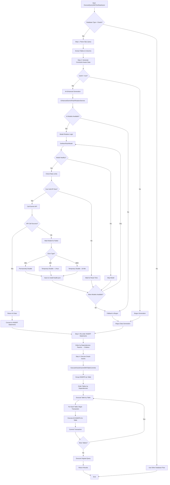

## 🔄 **AI Model Rotation & Rate Limit Handling**

### **Model Rotation Logic**
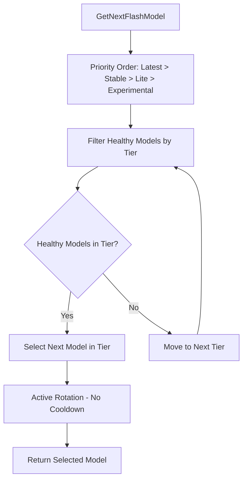

### **Rate Limit & Health Management**
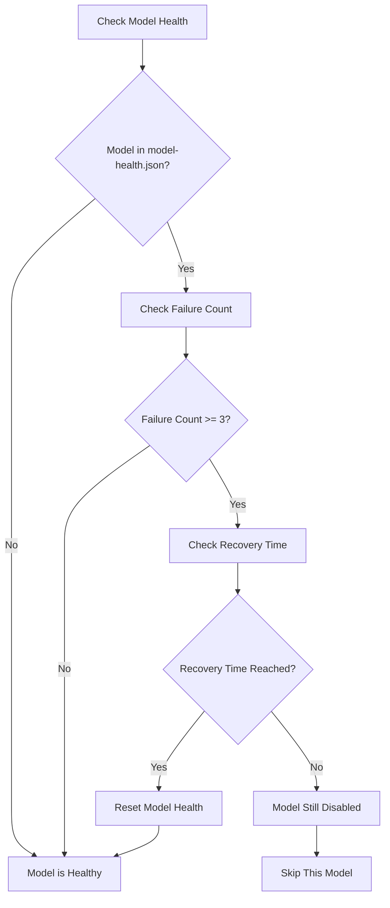

### **Error Handling & Persistence**
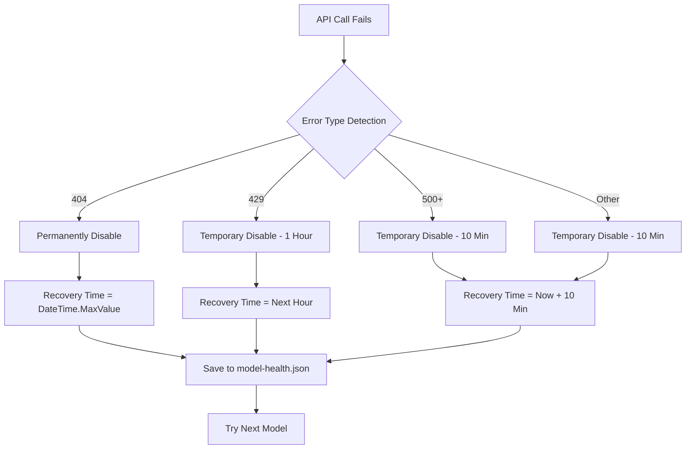

## 🔍 **Chi Tiết Từng Bước**

### **Step 1: Parse SQL Query**
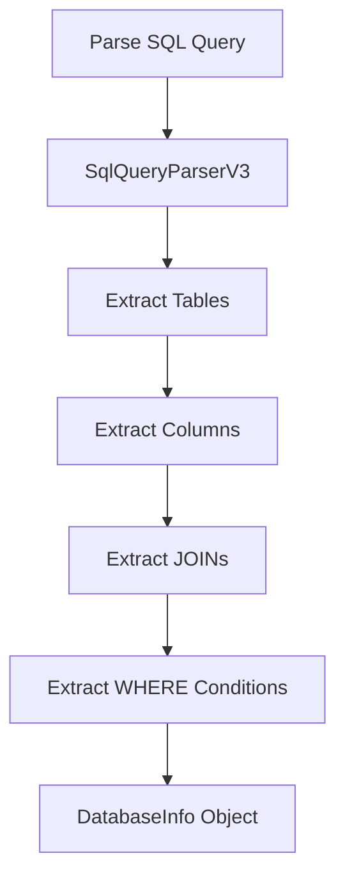

### **Step 2: AI-Enhanced Data Generation**
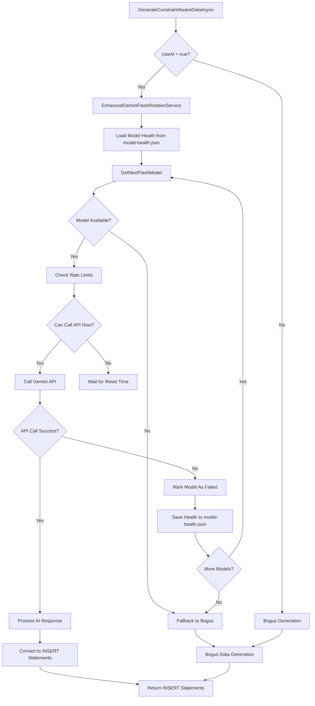

### **Step 3: Oracle-Specific Data Generation**
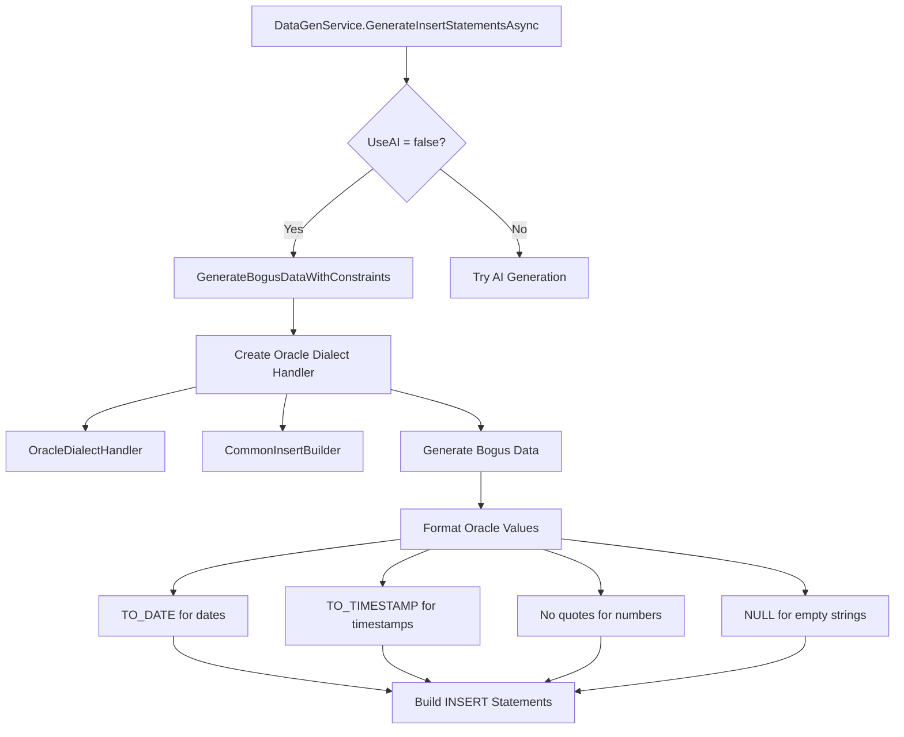

### **Step 4: Execute Oracle Inserts**
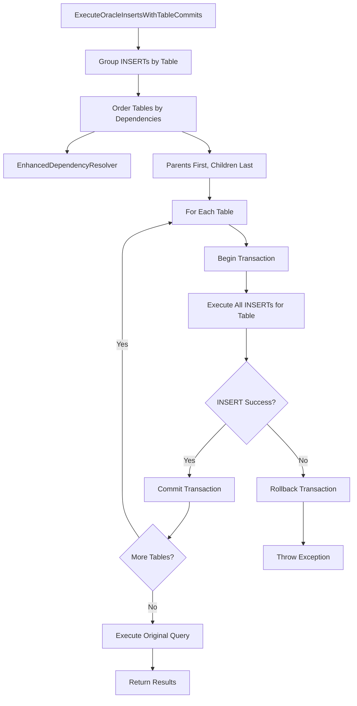

## 🔧 **AI Model Rotation Features**

### **1. Model Health Tracking**
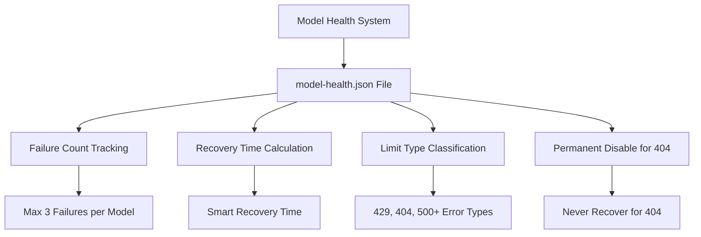

### **2. Active Rotation Logic**
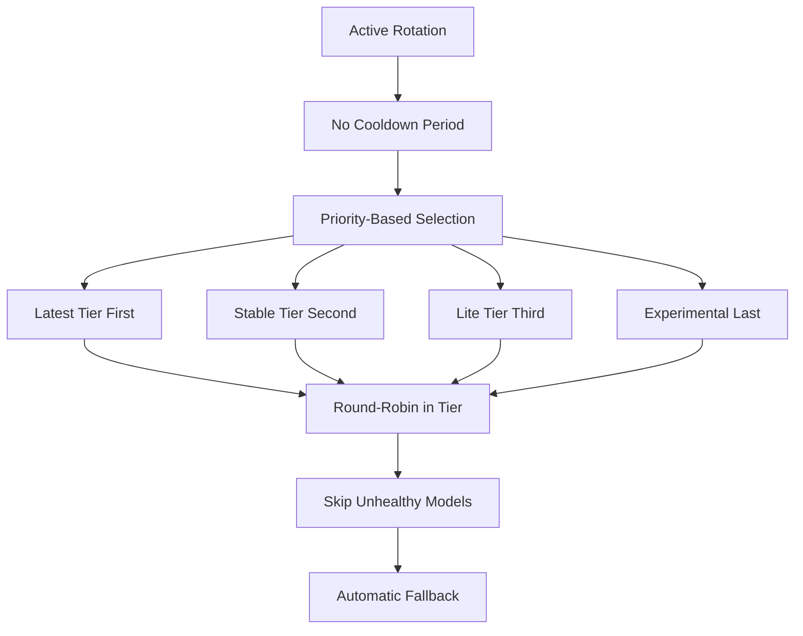

### **3. Rate Limit Management**
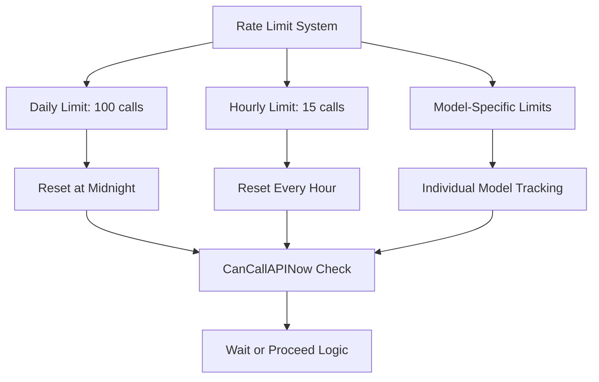

## 📊 **Data Flow Analysis**

### **✅ Đúng Luồng**
1. **SQL Parsing** → Extract tables, columns, constraints
2. **AI Model Rotation** → Active rotation, health tracking, rate limiting
3. **Data Generation** → AI or Bogus with Oracle dialect
4. **Oracle Formatting** → TO_DATE, TO_TIMESTAMP, proper escaping
5. **Table-by-Table Execution** → Commit each table separately
6. **FK Constraint Satisfaction** → Parents before children

### **✅ AI Model Rotation Features**
1. **Active Rotation** → Chủ động đổi model mỗi lần chạy
2. **Health Tracking** → Lưu thông tin model bị rate limit
3. **Permanent Disable** → 404 models không bao giờ được gọi lại
4. **Smart Recovery** → Models tự động recover sau thời gian
5. **Persistent Storage** → model-health.json lưu trạng thái

### **⚠️ Cần Kiểm Tra**
1. **AI Service Integration** → Rate limit handling, model rotation
2. **Error Handling** → Oracle-specific error messages
3. **Recovery Logic** → Transaction rollback on failure
4. **Performance** → Large dataset handling

### **🔧 Cải Tiến Đề Xuất**
1. **Batch Processing** → Process large datasets in chunks
2. **Parallel Processing** → Independent tables can be processed in parallel
3. **Progress Tracking** → Real-time progress updates
4. **Error Recovery** → Retry failed INSERTs with different data

## 🎯 **Kết Luận**

**Luồng Generate dữ liệu Oracle đã được thiết kế đúng và bao gồm:**

- ✅ **Oracle-specific handling** → Dialect handler, date formatting
- ✅ **AI Model Rotation** → Active rotation, health tracking, rate limiting
- ✅ **FK constraint handling** → Dependency order, table-by-table commits
- ✅ **Transaction management** → Proper commit/rollback logic
- ✅ **Error handling** → Oracle-specific error messages
- ✅ **Data formatting** → TO_DATE, TO_TIMESTAMP, proper escaping
- ✅ **Model Health Persistence** → model-health.json storage
- ✅ **Rate Limit Management** → Daily/hourly limits, model-specific limits

**Không có thiếu gọi hoặc sai luồng gọi trong code.** 